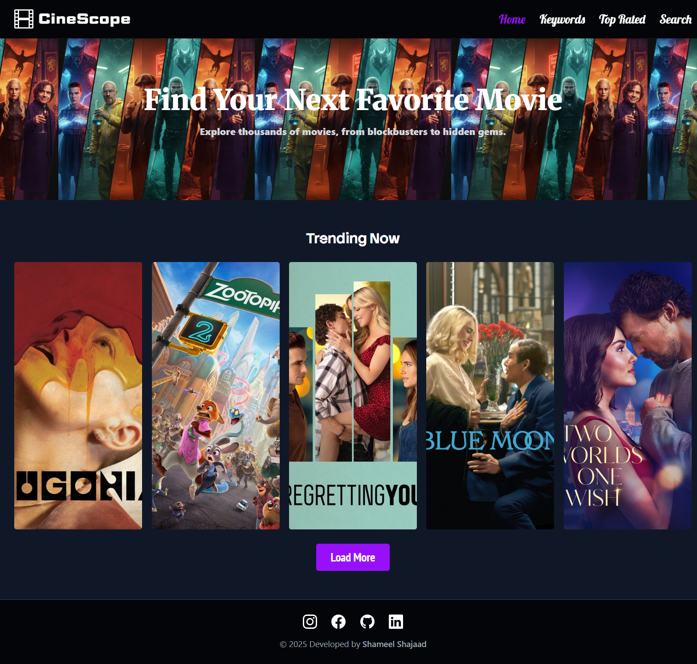
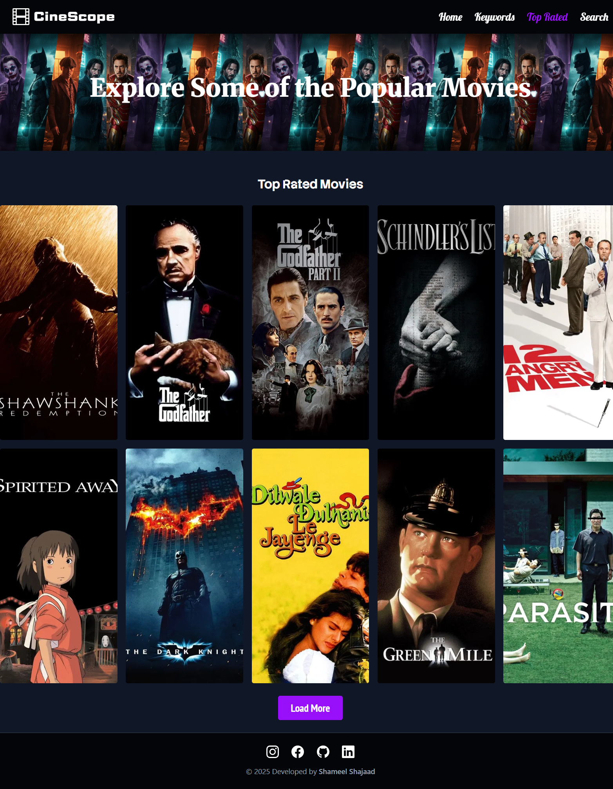

# 🎥 CineScope – Movie Explorer Web App

**Author:** Shameel Shajaad  
**Module:** Internet Technologies (ICET Institute)  
**Language/Frameworks:** HTML, CSS (Tailwind + Custom), JavaScript  

---

## 💡 Description

**CineScope** is a modern movie web application that allows users to **browse trending movies, explore top-rated films, search by name or IMDb ID, and filter movies by genre**. The app fetches real-time data from **TMDb** and **OMDb** APIs to provide detailed movie information, including cast, director, plot, and ratings.  

This project was developed as part of the **Internet Technologies final coursework** and demonstrates skills in **API integration, dynamic DOM manipulation, and interactive UI design**.  

> ⚠️ Note: The website is **not fully responsive yet**. Future updates will improve responsiveness for mobile and tablet devices.

---

## ⚡ Features

### Home Page – Trending Movies
- Displays trending movies dynamically  
- Hover effect shows **cast, director, plot, and IMDb rating**  

### Top-Rated Movies
- Explore **highest-rated films** from TMDb  
- "Load More" button fetches additional movies  

### Genre / Keyword Search
- Filter movies by genre using buttons  
- Interactive movie cards with hover overlays  

### IMDb / Name Search
- Search any movie by **IMDb ID** (OMDb API) or **movie name** (TMDb API)  
- Detailed results with plot, cast, and ratings  

### Interactive Hover Effects
- Cast, director, plot, and rating appear on hover  
- Smooth UI transitions for better experience  

---

## 🛠️ Technologies Used

- **HTML5** – Page structure and semantic layout  
- **CSS3 + Tailwind** – Styling and hover effects  
- **JavaScript (Vanilla)** – API requests, DOM updates, interactivity  
- **APIs**:  
  - [TMDb API](https://www.themoviedb.org/documentation/api) – Trending, top-rated, search by name, genre  
  - [OMDb API](https://www.omdbapi.com/) – Search by IMDb ID  

---

## 📂 Project Structure

CineScope/  
├── index.html  
├── keyword.html  
├── top_rated.html  
├── search.html  
├── assets/  
│   ├── css/  
│   │   └── style.css  
│   ├── js/  
│   │   ├── homepage.js  
│   │   ├── keyword.js  
│   │   ├── top_rated.js  
│   │   └── search.js  
│   ├── icons/  
│   │   └── *.svg  
│   └── images/  
│       └── *.png  
└── README.md  

---

## 📡 API Reference

- **TMDb API** – Movie discovery, trending/top-rated movies, genre search  
- **OMDb API** – IMDb ID-based search  

---

## 🖥️ Setup & Run Instructions

### Clone or Download the Repository
```bash
git clone https://github.com/ShameelShajaad/CineScope-Movie-App.git
```

---

## 🖥️ Open in Browser / Live Demo

- Local: Navigate to the folder and open `index.html` or any page in a modern browser (Chrome, Edge, Firefox)
- Online: [Visit CineScope](https://shameelshajaad.github.io/CineScope-Movie-App/)

---

## Usage

- **Home** – Browse trending movies  
- **Top Rated** – Explore top-rated films  
- **Keyword / Genre Search** – Filter movies by genre  
- **Search** – Find movies by name or IMDb ID  
- Hover over movie cards to see **cast, director, plot, and rating**

---

## 📸 Screenshots

-**HomePage Overview**



-**Keyword Overview**


-**Top Rated Overview**



-**Search Overview**


---

## 🔮 Future Improvements

- Improve **mobile and tablet responsiveness**  
- Add **infinite scroll** for longer movie lists  
- Centralize JS functions to reduce repetition  
- Implement **dark/light mode toggle**  
- Add **sorting options** (by year, rating, popularity)  

---

## 👨‍💻 Author

**Shameel Shajaad** – Diploma in Software Engineering, ICET Institute  

---

## ⭐ Support

If you like this project, consider giving it a ⭐ on GitHub!
